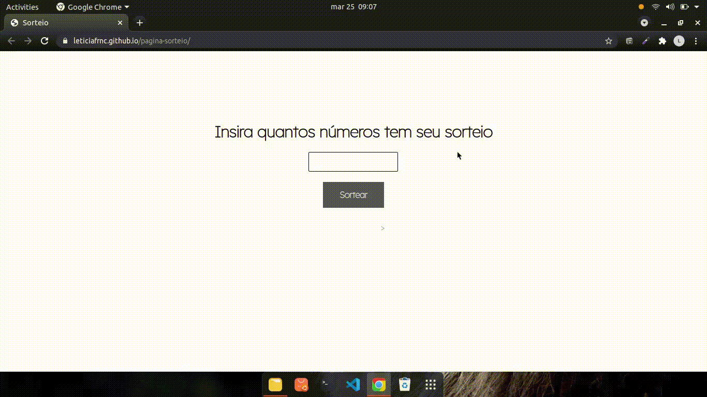

### Página Sorteio

A Página de Sorteio  foi desenvolvida com HTML e CSS e JS com o objetivo de demostrar meu aprendizado com o objeto Math.

### Características
Esta Landing Page apresenta um formato clean para demostrar seu trabalho, é adaptada em todas as telas.

### Instalação 

Clone este repositório usando git clone https://github.com/Leticiafrnc/pagina-sorteio.git ou clique em Code/Download ZIP.
Clique no arquivo "index.HTML" e veja a aplicação.

